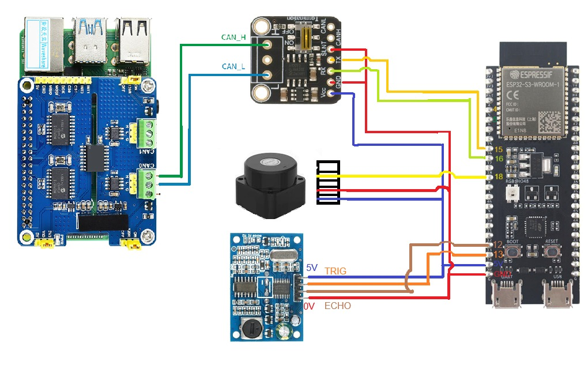
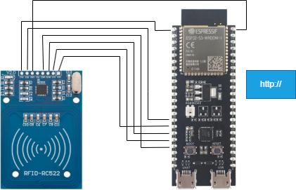
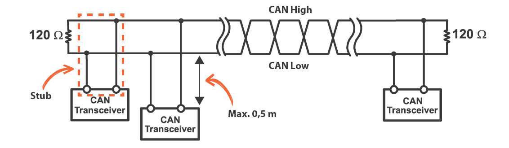

# Automação 2 - Segurança no chão de fábrica

## Introdução

**Objetivo Geral:** Sistema inteligente de monitorização e segurança de áreas restritas com controle de acesso por cartão(RFID).

A sensorização é uma parte muito importante do ambiente fabril, não só nas linhas de produção, como componente nuclear do processo de automação, mas também no estabelecimento e manutenção de um ambiente seguro. Dessa maneira, é de suma importância que o sistema de segurança estabelecido seja fiável, eficiente e de tão fácil uso quanto possível.

**Adicionar imagem de um esquema do ambiente a ser monitorado**

O sistema desenvolvido consiste em um conjunto de sensores, ligados por um barramento, de forma que existam restrições de entrada e limitação do espaço de circulação. Além disso, também podem haver sensores que observam as condições de equipamentos.

## Descrição do Funcionamento

1. Cada pessoa possui um cartão RFID com um identificador único (ID). Quando tenta aceder à sala, o leitor comunica com a ESP32 que verifica na sua memória se o utilizador está na lista de permissões.
2. Nesta verificação o acesso é concedido ou negado e a unidade central(RaspberryPi) é informada, através de MQTT, sobre o acesso.
3. Após a entrada na sala, um sensor LiDAR mapeia a posição da pessoa em tempo real para averiguar em que zona ela se encontra.
4. Conforme a posição, o sistema reage autonomamente ativando uma luz que indica o risco a que a pessoa está sujeita.

## Materiais e Recursos
- **Raspberry Pi:** Atua como computador central
- **Sensor LIDAR:** Recurso para identificação e monitorização de coordenadas em tempo real.
- **RFID:** Utilizado para o controle de acesso e identificação de utilizadores.
- **Microcontrolador:** Responsável por ler o sensor RFID, verificar se o utilizador está ou não autorizado e comunicar os eventos de acesso via Wi-Fi utilizando o protocolo MQTT.
- **Sinalizadores Físicos:** LED para indicação visual da violação da zona de perigo.
- **HTTP (Wi-Fi):** Protocolo base para comunicação do computador central com a HMI.
- **Barramento CAN:** Utilizado para a comunicação entre a unidade central com os periféricos (sensores e atuadores).
- **HTML:** Linguagem estrutural utilizada para apresentar os dados e autorizar IDs de forma dinâmica.
- **MQTT:** Protocolo de mensagens utilizado para a comunicação de eventos em tempo real entre a ESP32 e o cérebro central (Raspberry Pi).

## Descrição do Sistema

O sistema foi feito de forma a ser de uso fáci, intuitivo e de conveniente manutenção.

### Hardware

A parte física do sistema é formada por um conjunto de sensores

**LiDAR** - O LiDAR foi utilizado de forma a detetar pessoas no interior do ambiente a ser observado, e avisar sobre o seu posicionamento. Esse aviso vai ser relativo a zonas de três tipos - **seguro**, **aviso** e **perigo**.

**Sensor Ultrassónico** - O sensor ultrassónico foi utilizado para reprensentar um sensor genérico que observa um equipamento. Neste caso, utilizamos esse sensor para imitar um observador de nivél em um tanque de água.

**Leitor RFID** - O leitor RFID foi posto à entrada do ambiente a ser controlado de forma a limitar o acesso apenas para pessoas autorizadas.

**CAN 2.0A** - O CAN é um protocolo, de nível físico e digital, de comunicação em barramento. Ele vai permitir a adição e remoção de sensores de forma modular, assim evitando que defeitos ou manutenção em um módulo não interrompa funcionamento dos outros. 

**Sinalizadores Físicos** - Os leds vão ser usados como indicadores visuais de perigo.

## Lógica de Controlo e Segurança 

**Validação (Dinâmica) de IDs:** Camada de segurança que verifica o ID e permite ou rejeita a entrada com base nos IDs autorizados.
**Processamento de Sinais:** Conversão das leituras do LIDAR em zonas lógicas:
  - Zona Livre: Pessoa fora de perigo
  - Zona Restrita: Alerta visual na página HTML.
  - Zona de Perigo: Ativação da luz vermelha.
**HMI (Interface Homem-Máquina):** Dashboard em HTML que apresenta a posição em tempo real, o histórico de entradas e uma lista dinâmica com campos onde podemos permitir, rejeitar ou alterar informações dos usuários autorizados.

### Software

Para mostrar a possibilidade de um sistema descentralizado, utilizamos uma Raspberry Pi para fazer o processamento dos dados e apresenta-los em uma página web, de uma rede local, enquanto que a gestão de permissões de acesso foi desenvolvida em uma ESP32 aparte. Dessa forma, romovemos a comunicação wireless por WiFi entre diferentes servidores onde a falha de um não implica parar o outro.

Nesta página podemos observar um ***live feed*** das leituras do LiDAR, assim como uma ***dashboard*** da interpretação dos dados. Além disso, o valor das leituras do sensor ultrassónico são apresentados de forma dinâmica com a ilustração de um tanque da água. Por fim, podemos também observar a listagem das pessoas que estão no interior do ambiente controlado a partir das leituras do RFID.

**Interface de Gestão e Servidor Web:**
Além do painel de monitorização visual, o sistema conta com uma página HTML servida diretamente pela ESP32-S3 via protocolo HTTP. Esta HMI permite ao supervisor:
- Adicionar e remover acessos de utilizadores de forma dinâmica;
- Alterar e acrescentar informações de contacto;
- Consultar uma tabela em tempo real com os utilizadores autorizados (Nome, ID e Contacto).

Os dados desta página são guardados na memória não-volátil da ESP32, garantindo persistência de dados em caso de falha de energia.

*descrever página e funcionamento*

### Tecnologias
**C++:** 
**Python:** 
**HTML/CSS:**
**Mosquitto (Broker MQTT):??**

