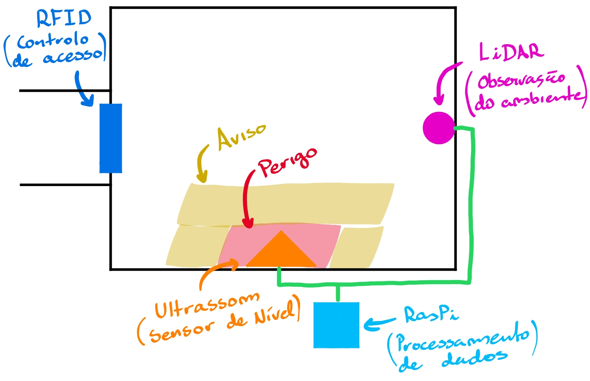
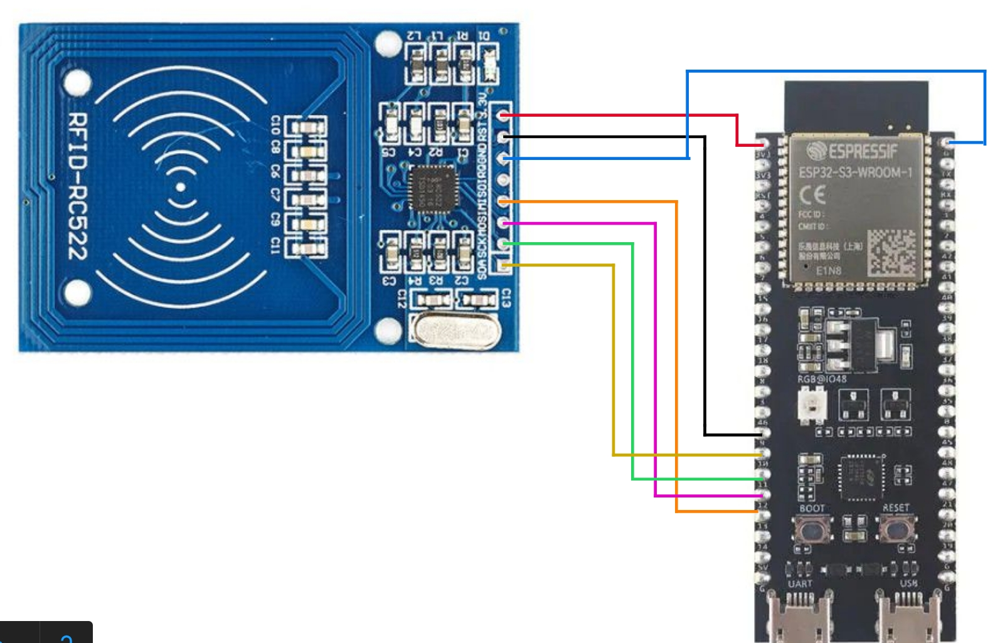
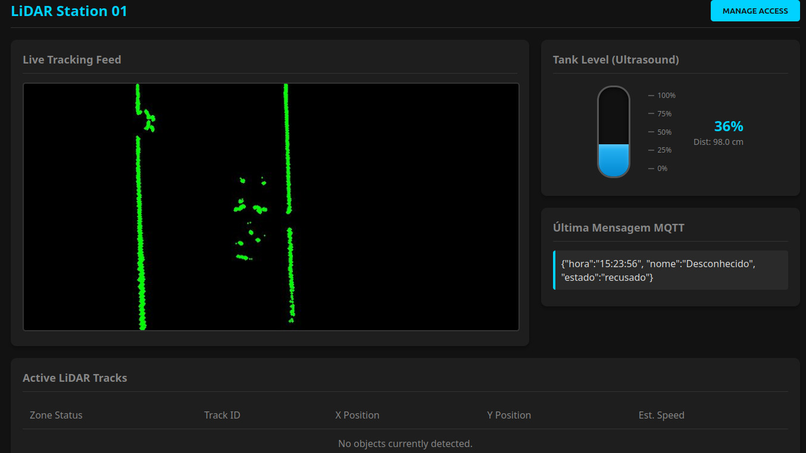
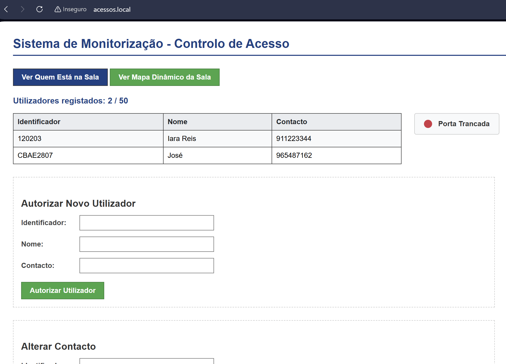

# Automação 2 - Segurança no chão de fábrica

## Introdução


**Objetivo Geral:** Sistema inteligente de monitorização e segurança de áreas restritas com controle de acesso por cartão(RFID).

A sensorização é uma parte muito importante do ambiente fabril, não só nas linhas de produção, como componente nuclear do processo de automação, mas também no estabelecimento e manutenção de um ambiente seguro. Dessa maneira, é de suma importância que o sistema de segurança estabelecido seja fiável, eficiente e de tão fácil uso quanto possível.



O sistema desenvolvido consiste em um conjunto de sensores, ligados por um barramento, de forma que existam restrições de entrada e limitação do espaço de circulação. Além disso, também podem haver sensores que observam as condições de equipamentos.


## Setup


Partindo do princípio que as ESPs já foram *flashadas* com seus respetivos códigos.

Na RaspberryPi:

Dependências:
```
sudo apt update

// build
sudo apt install -y build-essential cmake git libssl-dev can-utils net-tools

// computer vision
sudo apt install -y libopencv-dev python3-opencv

// mosquitto MQTT
sudo apt install -y mosquitto mosquitto-clients

// adicione as linhas "listener 1883" e "allow_anonymous true"
nano /etc/mosquitto/mosquitto.conf

sudo systemctl enable mosquitto
sudo systemctl start mosquitto
```

O MQTT foi programado com uso de *wrappers* paho.mqtt para C e C++ disponibilizadas no github.
```
// C
cd ~
git clone https://github.com/eclipse/paho.mqtt.c.git
cd paho.mqtt.c
mkdir build && cd build
cmake -DPAHO_WITH_SSL=ON -DPAHO_BUILD_DOCUMENTATION=OFF -DPAHO_BUILD_SAMPLES=OFF ..
make -j4
sudo make install
sudo ldconfig

// C++
cd ~
git clone https://github.com/eclipse/paho.mqtt.cpp.git
cd paho.mqtt.cpp
mkdir build && cd build
cmake -DPAHO_WITH_SSL=ON -DPAHO_BUILD_DOCUMENTATION=OFF -DPAHO_BUILD_SAMPLES=OFF ..
make -j4
sudo make install
sudo ldconfig
```

Compilação e execução dos códigos
```
// compilação de cógigos em um binário executavel
g++ central_code.cpp src/DBscan.cpp -std=c++17 -o a2App -lpaho-mqttpp3 -lpaho-mqtt3as $(pkg-config --cflags --libs opencv4)
g++ makeMap.cpp src/DBscan.cpp src/ProcessorCAN.cpp -std=c++17 -o makeMap $(pkg-config --cflags --libs opencv4)

// mapear local vazio previamente
./makeMap

// iniciar sistema e servidor http
./a2App
```

O código `makeMap.cpp` utiliza `cv::show()` que é dependente de sistemas de *rendering* e gestão de janelas do linux. De uma forma geral, a biblioteca de *computer vision* tem comportamento mais estável para OS em Linux.

O mapa construído, previamente a iniciação do sistema, serve para facilitar a visualização de objetos no interior e para evitar que objetos estacionários do ambiente sejam confundidos com pessoas, conforme a visão do LiDAR é obstruída e os pontos deslocam-se.

## Descrição do Funcionamento


1. Cada pessoa possui um cartão RFID com um identificador único (ID). Quando tenta aceder à sala, o leitor comunica com a ESP32 que verifica na sua memória se o utilizador está na lista de permissões.
2. Nesta verificação o acesso é concedido ou negado e a unidade central(RaspberryPi) é informada, através de MQTT, sobre o acesso.
3. Após a entrada na sala, um sensor LiDAR mapeia a posição da pessoa em tempo real para averiguar em que zona ela se encontra.
4. Conforme a posição, o sistema reage autonomamente ativando uma luz que indica o risco a que a pessoa está sujeita.


## Materiais e Recursos


- **Raspberry Pi:** Atua como computador central;
- **Sensor LIDAR:** Recurso para identificação e monitorização de coordenadas em tempo real;
- **RFID:** Utilizado para o controle de acesso e identificação de utilizadores;
- **Microcontrolador:** Responsável por ler o sensor RFID, verificar se o utilizador está ou não autorizado e comunicar os eventos de acesso via Wi-Fi utilizando o protocolo MQTT;
- **HTTP (Wi-Fi):** Protocolo base para comunicação do computador central com a HMI;
- **Barramento CAN:** Utilizado para a comunicação entre a unidade central com os periféricos (sensores e atuadores);
- **HTML:** Linguagem estrutural utilizada para apresentar os dados e autorizar IDs de forma dinâmica;
- **MQTT:** Protocolo de mensagens utilizado para a comunicação de eventos em tempo real entre a ESP32 e o cérebro central (Raspberry Pi);
- **UDP(User Datagram Protocol):** É um protocolo de transporte de rede usado para comunicações que exigem velocidades altas e processamento baixo;
- **NTP (Network Time Protocol):** É um protocolo que corre por cima do UDP, utilizado para ligar microcontroladores a servidores de horas mundiais;
- **AJAX (Asynchronous JavaScript and XML):** Técnica de programação web que permite ao navegador atualizar partes específicas da página em segundo plano, sem necessidade de recarregar o ecrã inteiro.


## Bibliotecas utilizadas


Para organizar o código e implementar todas as funcionalidades de rede, armazenamento e comunicação, o software da ESP32 e Raspberry Pi foi estruturado usando bibliotecas específicas e ficheiros desenvolvidos localmente.

### Ficheiros locais desenvolvidos no Projeto
* **`index.h`:** Armazena a estrutura em HTML/CSS e os marcadores dinâmicos da página principal de gestão e administração de utilizadores.
* **`Presencas.h`:** Contém a interface e a lógica do painel de monitorização das pessoas presentes na sala em tempo real.
* **`lidar_page.html`:** Apresenta a visão do LiDAR sobre o ambiente mapeado, leitura do ultrassom e alguns outros dados obtidos por MQTT e processamento dos dados.

### Bibliotecas Nativas 
* **`<WiFi.h>`:** Fornece o suporte de rede necessário para que a ESP32 consiga ligar-se ao ponto de acesso Wi-Fi local.
* **`<WebServer.h>`:** Permite configurar a placa como um servidor HTTP para escutar os pedidos do navegador, processar formulários e servir as páginas web.
* **`<Preferences.h>`:** Permite aceder e gravar dados na memória Flash do microcontrolador.
* **`<ESPmDNS.h>`:** Configura o serviço DNS multicast local, permitindo que o operador aceda ao painel através de um domínio invés de digitar o endereço IP.
* **`<WiFiUdp.h>`:** Cria a base de comunicação através do protocolo UDP, um requisito essencial para a troca de pacotes com os servidores de tempo.
* **`<Thread>`**, **`<mutex>`**, **`<condition_variable>`**, **`<atomic>`**, **`<csignal>`:** Conjunto utilizado para controlo de concorrência e sincronização de dados.
* **`<sys/socket.h>`**, **`<sys/ioctl.h>`**, **`<net/if.h>`**, **`<linux/can.h>`:** Bibliotecas de controlo de comunicação de baixo nível.

### Bibliotecas Externas 
* **`<NTPClient.h>`:** Liga-se a servidores de tempo online (`pool.ntp.org`) para obter e sincronizar a hora exata.
* **`<PubSubClient.h>`:** Implementa a arquitetura de comunicação MQTT, permitindo à placa conectar-se ao Broker e publicar os pacotes JSON.
* **`<opencv2/opencv.hpp>`:** Biblioteca de processamento de imagens.
* **`<httplib.h>`:** Biblioteca de gestão simplificada de clientes/servidores HTTP/HTTPS.


## Hardware


A parte física do sistema é formada por um conjunto de sensores


**LiDAR** - O LiDAR foi utilizado de forma a detetar pessoas no interior do ambiente a ser observado, e avisar sobre o seu posicionamento. Esse aviso vai ser relativo a zonas de três tipos - **seguro**, **aviso** e **perigo**.

**Sensor Ultrassónico** - O sensor ultrassónico foi utilizado para reprensentar um sensor genérico que observa um equipamento. Neste caso, utilizamos esse sensor para imitar um observador de nivél em um tanque de água.



**Leitor RFID** - O leitor RFID foi posto à entrada do ambiente a ser controlado de forma a limitar o acesso apenas para pessoas autorizadas.


**CAN 2.0A** - O CAN é um protocolo, de nível físico e digital, de comunicação em barramento. Ele vai permitir a adição e remoção de sensores de forma modular, assim evitando que defeitos ou manutenção em um módulo não interrompa funcionamento dos outros. 


## Software

O software foi dividido em duas partes, a unidade central(Raspberry Pi)  e o controlo de acessos(ESP32).

### 1. Unidade Central (Raspberry Pi)

Para mostrar a possibilidade de um sistema descentralizado, utilizamos uma Raspberry Pi para fazer o processamento dos dados e apresenta-los em uma página web, de uma rede local, enquanto que a gestão de permissões de acesso foi desenvolvida em uma ESP32 aparte. Dessa forma, promovemos a comunicação wireless por WiFi entre diferentes servidores onde a falha de um não implica parar o outro.

O sistema de detecção e acompanhamento de objetos funciona utilizando o ***DBSCAN** (Density-Based Spatial Clustering of Applications with Noise)* e calculando centroídes, que serão marcados e acompanhados, em cada uma das leituras do LiDAR. Um sensor ultrassónico foi introduzido para mostrar a modularização do sistema.



Nesta página podemos observar um ***live feed*** das leituras do LiDAR, assim como uma ***dashboard*** da interpretação dos dados. Além disso, o valor das leituras do sensor ultrassónico são apresentados de forma dinâmica com a ilustração de um tanque da água.

### 2. Controlo de Acessos (ESP32)

Além do painel de monitorização visual, o sistema conta com uma página HTML servida diretamente pela ESP32-S3 via protocolo HTTP.

#### 2.1. O "Cérebro" do Sistema (`Aut_2_projeto.ino`)

Este é o ficheiro central do projeto, responsável por integrar a lógica de controlo e gerir blocos fundamentais:

* **Controlo de Hardware (SPI):** Gere a comunicação direta com o leitor RFID MFRC522. O ciclo principal de execução (`loop`) foi programado de forma a não bloquear, isto significa que a ESP32 consegue ler a *tag* de um cartão em milissegundos, sem interromper ou atrasar o tempo de resposta do servidor web.
*  **Lógica anti-bloqueio:** Para controlar o tempo que a porta fica aberta (3segundos) utilizamos o millis() invés do delay(), desta forma a página web continua a ser processada e a leitura de cartões ocorre normalmente.
* **Base de Dados Não-Volátil (`Preferences`):** Para evitar a perda da lista de utilizadores autorizados sempre que o sistema é desligado, utilizámos a memória Flash interna da ESP32. Foi criada uma estrutura de dados (`struct`) que guarda o ID, o Nome e o Contacto, permitindo que quando um utilizador é adicionado ou removido, através da interface web, a base de dados é atualizada e gravada instantaneamente.
* **Sincronização de Tempo:** O sistema liga-se a servidores de tempo online (`pool.ntp.org`) através do protocolo UDP. Isto permite registar a hora exata, sincronizada com o fuso horário de Portugal, em cada entrada e saída, criando um histórico fiável.


|  |  |


#### 2.1.1. Fluxograma Lógico de Decisão

A sequência seguinte resume o funcionamento, de forma ordenada, do ficheiro `Aut_2_projeto.ino` sempre que é detetado um cartão pelo RFID.
1. **Leitura Física:** Extrai o UID do cartão RFID via barramento SPI. 
2. **Consulta Local:** Percorre o array guardado na memória `Preferences` à procura do UID correspondente. 
3. **Decisão de Acesso:** 
   * **Se encontrar (Acesso Autorizado):** Abre a porta e inverte o estado de presença do utilizador alternando entre `true` e `false` conforme o movimento de entrada ou saída.
   * **Se não encontrar (Acesso Recusado):** Mantém a porta trancada e regista "Acesso Negado" no histórico local.
4. **Registro da hora:** Sempre que um cartão é detetado, o sistema efetua um pedido via UDP ao servidor NTP para atualizar o relógio interno da ESP. Esta hora é utilizada tanto para o registo de logs locais como para o envio do pacote via MQTT. 
5. **Sincronização:** Formata o pacote JSON com os dados e faz o *publish* no *Broker* MQTT, a publicação consiste na hora, nome e estado( `”recusado”`,`”entrou”` ou `”saiu”`).
6. **Atualização da HMI:** Renderiza as novas tabelas HTML para que fiquem prontas na próxima requisição do browser. 


#### 2.2. Interface HMI de Gestão de acessos (`index.h`)
Este ficheiro armazena o código HTML e CSS da página de configuração principal. O seu funcionamento e integração com o microcontrolador dividem-se em três partes fundamentais:

* **Armazenamento Eficiente:** O código da interface gráfica é guardado diretamente na memória de programa da ESP32-S3 (`PROGMEM`). Esta abordagem evita o desperdício de memória RAM, permitindo que a placa funcione como um servidor HTTP estável sempre que o operador acede ao domínio `http://acessos.local`.
* **Renderização Dinâmica:** Para que a página exiba dados reais, foram integrados marcadores de substituição no HTML. Antes de enviar a página para o navegador, o código  percorre a matriz de utilizadores, gera as linhas da tabela em HTML e substitui os marcadores pelos dados atualizados.
* **AJAX:** Para atualizar o estado da porta na página principal foi usado o AJAX invés do recarregamento(Refresh), desta forma adquirimos o estado da porta sem interferir com os formulários.
* **Submissão de Dados:** O controlo administrativo (autorizar utilizadores, alterar contactos e remover acessos) é feito através de formulários web, estes formulários enviam os dados estruturados através do método **HTTP POST**, cujos parâmetros são tratados em tempo real pelas funções da ESP32.

#### 2.3. Painel de Monitorização em Tempo Real (`Presencas.h`)
Este ficheiro é responsável pela interface de monitorização e pode ser acedido através do botão `Ver Quem Está na Sala` presente na página principal. O seu objetivo é funcionar como um *dashboard* de segurança, cujo funcionamento baseia-se em dois pilares:

* **Filtro de Presenças:** Para mostrar exclusivamente quem se encontra no interior da sala, o software percorre a estrutura de dados em tempo real e constroi dinamicamente uma tabela HTML que exibe apenas os funcionários presentes e a respetiva hora de entrada.
  
* **Atualização Visual Automática (refresh):** Para que o painel funcione como um fluxo de informação contínuo, foi integrada uma *meta tag* que força o navegador a atualizar-se sozinho a cada 2 segundos, solicitando os dados mais recentes da ESP32-S3. Isto permite que a tabela adicione novas linhas quando alguém entra e as remova quando alguém sai de forma totalmente automática e sem intervenção manual.


#### 2.4. Integração e Telemetria via MQTT
Apesar da ESP32-S3 tomar todas as decisões de acesso de forma autónoma, ela não funciona de forma isolada no ecossistema da fábrica. Para manter o sistema global interligado, a placa assume o papel de **MQTT Publisher**, dividindo a transmissão de dados em duas etapas: 

* **Comunicação por Eventos:** Sempre que uma *tag* é detetada pelo leitor RFID, a ESP32 publica instantaneamente uma mensagem no tópico `sala/acessos`. Esta arquitetura baseada em eventos evita o desperdício de largura de banda na rede Wi-Fi, uma vez que a placa só comunica quando existe uma alteração física no estado da porta (uma entrada, uma saída ou uma tentativa de acesso negado).
* **Formato JSON:** A informação do evento é empacotada de forma compacta numa estrutura **JSON** padrão que contém o ID do cartão, o nome do utilizador e o estado correspondente (*"entrou"*, *"saiu"* ou *"recusado"*). Este pacote de dados é recebido pela unidade central (Raspberry Pi).
